# oshiPFP

Turn a drawing or illustration into a profile picture that stays sharp and legible at small
thumbnail sizes — crop, thicken/stylize the linework, grade the color, export.

<picture>
  <source media="(prefers-color-scheme: dark)" srcset="public/about/darkscreen.webp">
  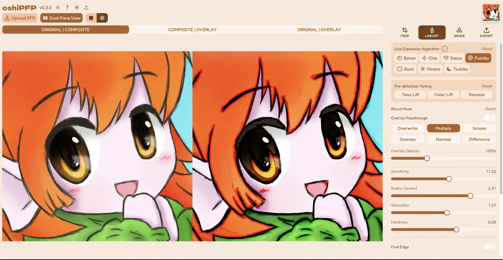
</picture>

**[Try it live](https://oshipfp.netlify.app/)** — nothing you upload leaves your browser (see
[How it works](#how-it-works)).

## Features

- **7 tunable line-art algorithms** — Botan, Chie, Daiya, Fumiko, Gumi, Hinata, Tsukiko — each
  grows, thickens, colorizes, or textures existing linework in a different way. Pick one, tune it
  live against your own image. See the [showcase](#seven-algorithms) below.
- **Crop** with pinch/scroll-wheel zoom and pan, square or free-form.
- **Color grading** — curves, HSL, light/temperature/tint, gradient-map remapping.
- **Export** at native or custom resolution, PNG or JPEG, with independent color-grade intensity.
- **Dual Pane** side-by-side comparison view on desktop.
- Built-in preset gallery with real before/after examples per algorithm — the same examples shown
  below, loadable straight into the app as a starting point.

## How it works

Everything runs client-side in a single shared WebGL2 canvas — image upload, cropping, line-art
processing, color grading, and export all happen in your browser via raw WebGL2 shader passes, no
server round-trip. Nothing you upload is ever sent anywhere.

The pipeline is a fixed stage chain: **Crop → Line Art → Grade → Export**. Each stage renders to
an offscreen texture that the next stage samples from; only the final composite gets blitted to
the on-screen canvas. Export reads the full-resolution offscreen texture directly, so output
quality isn't capped by whatever size the live preview happens to be rendered at.

## Seven algorithms

Every algorithm starts from the same source image and the same fixed pipeline — what differs is
how each one detects and regrows linework. Two presets per algorithm below; the full gallery (5
each, plus every tunable parameter) is in the app itself via "Load Demo".

<!--
  Picks below default to presets 01 + 03 per algorithm — a placeholder selection, not a curated
  one. Nobody has actually eyeballed all 5×7 before/afters against each other yet; swap in
  whichever pair reads best. algo one-liners are inferred from pipeline.ts/labPipeline.ts code
  comments (JFA distance grow, octagon dilation, high-pass, Laplacian, etc.), not from any
  existing marketing copy — worth a sanity check against the actual rendered output too.
-->

<table>
<tr><th>Algorithm</th><th>Before</th><th>After</th></tr>

<tr><td rowspan="2"><strong>Botan</strong><br>The default. Solid distance-field growth off a
threshold mask, filled flat, gradient, or from the image's own color.</td>
<td></td>
<td></td></tr>
<tr><td></td>
<td></td></tr>

<tr><td rowspan="2"><strong>Chie</strong><br>Botan's growth model with its own fill pass —
different color behavior on the same underlying grow/threshold.</td>
<td>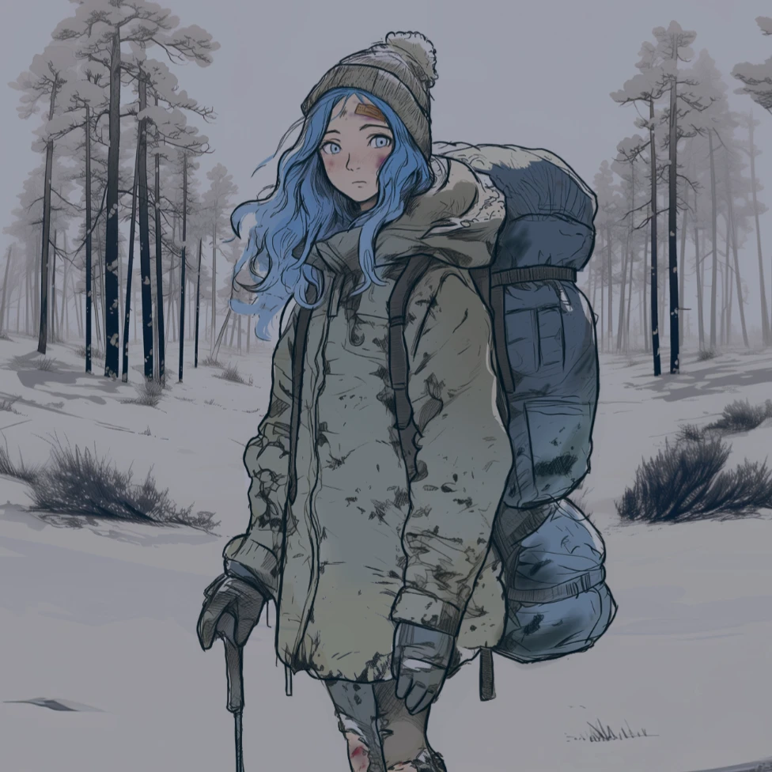</td>
<td>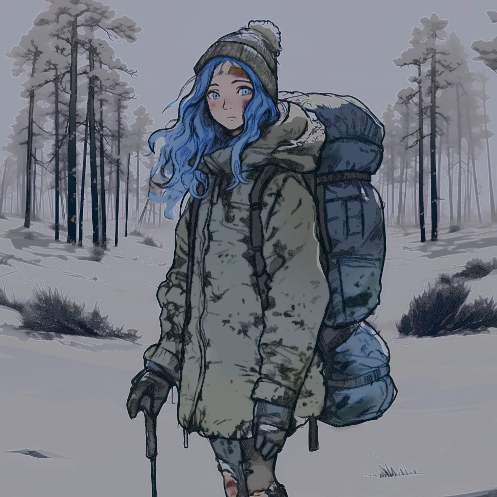</td></tr>
<tr><td></td>
<td>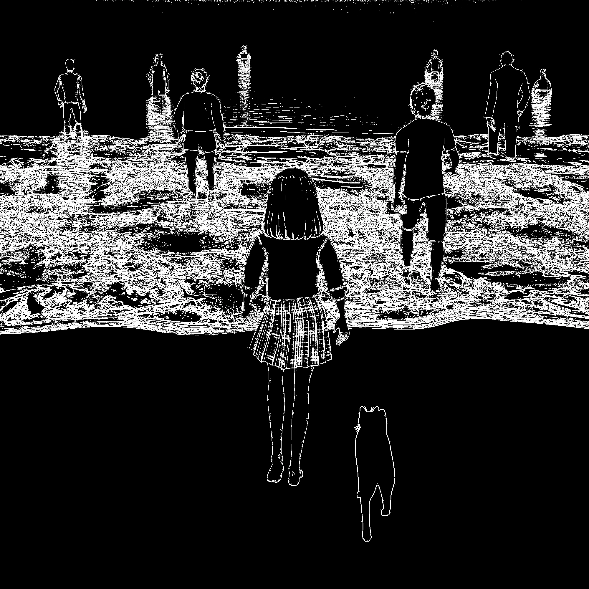</td></tr>

<tr><td rowspan="2"><strong>Daiya</strong><br>Octagon-approximation growth — four directional
dilation passes for rounder, more organic thickening, with a soft-threshold edge.</td>
<td>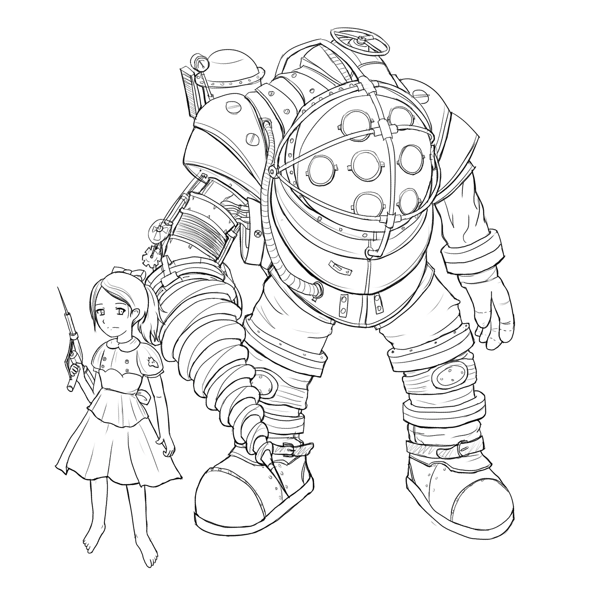</td>
<td></td></tr>
<tr><td>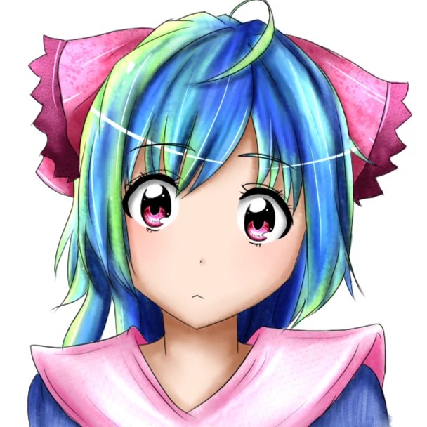</td>
<td></td></tr>

<tr><td rowspan="2"><strong>Fumiko</strong><br>Thin, mostly-binary colored edges — built to take
tint layering well where flatter fills wouldn't.</td>
<td></td>
<td></td></tr>
<tr><td>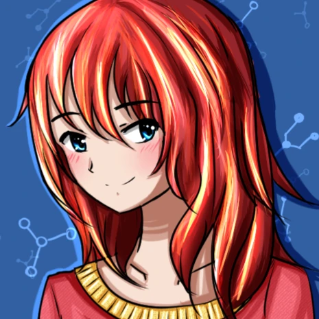</td>
<td></td></tr>

<tr><td rowspan="2"><strong>Gumi</strong><br>Isolates a single luminance band via gradient-map,
then regrows it — good at pulling line work out of painterly, non-flat source art.</td>
<td>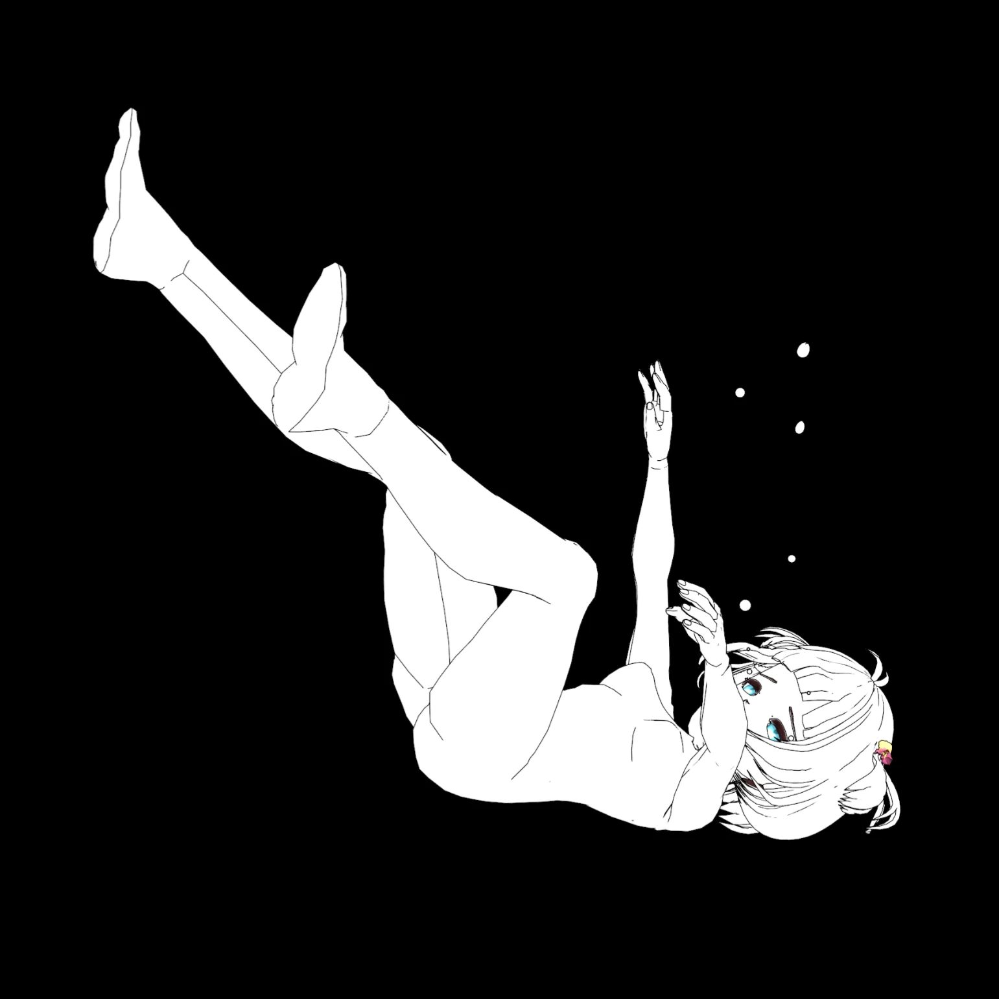</td>
<td>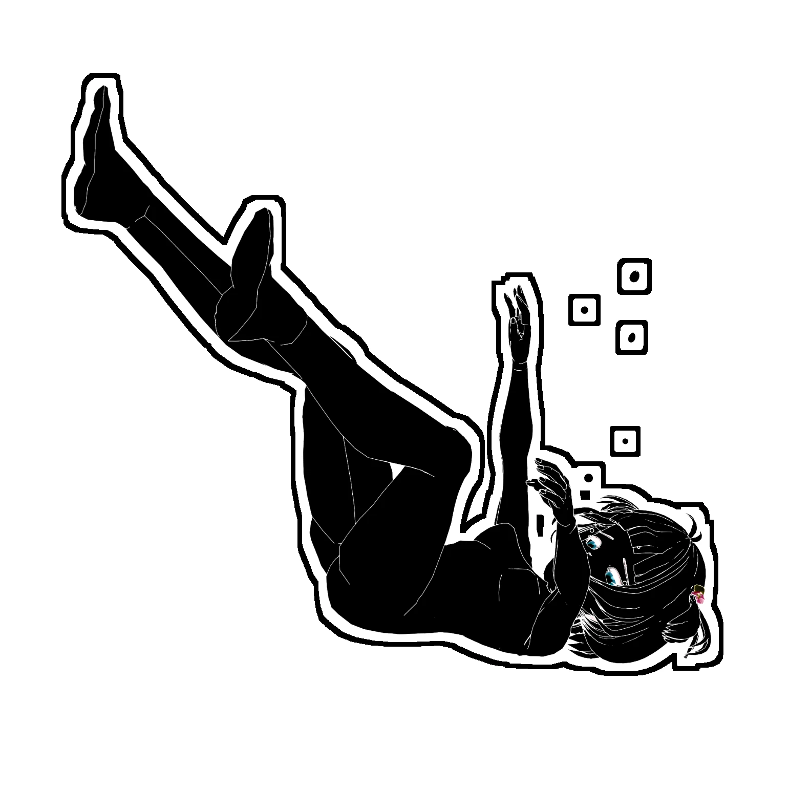</td></tr>
<tr><td>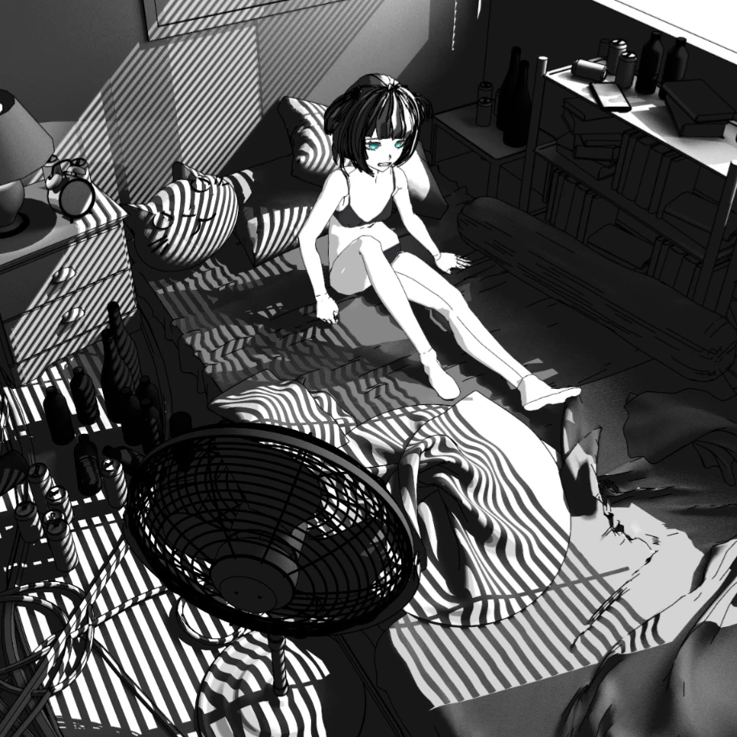</td>
<td></td></tr>

<tr><td rowspan="2"><strong>Hinata</strong><br>High-pass detection — box-blur subtracted from
source — for crisp linework pulled out of photographic detail.</td>
<td></td>
<td></td></tr>
<tr><td></td>
<td></td></tr>

<tr><td rowspan="2"><strong>Tsukiko</strong><br>Laplacian edge detection with optional pre-blur —
finer, more textured line work than the high-pass path.</td>
<td>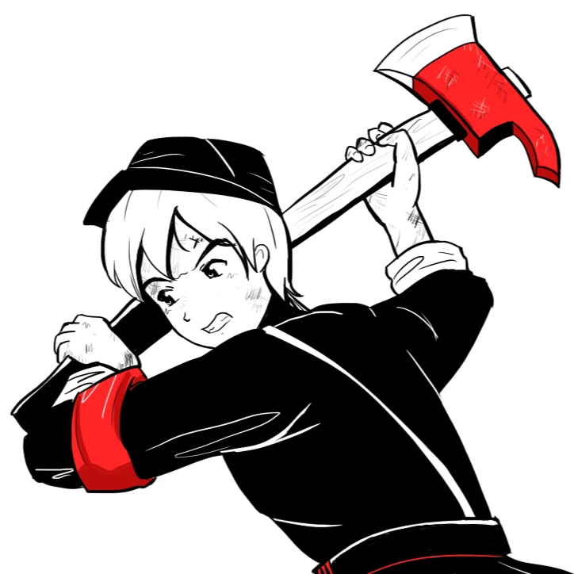</td>
<td>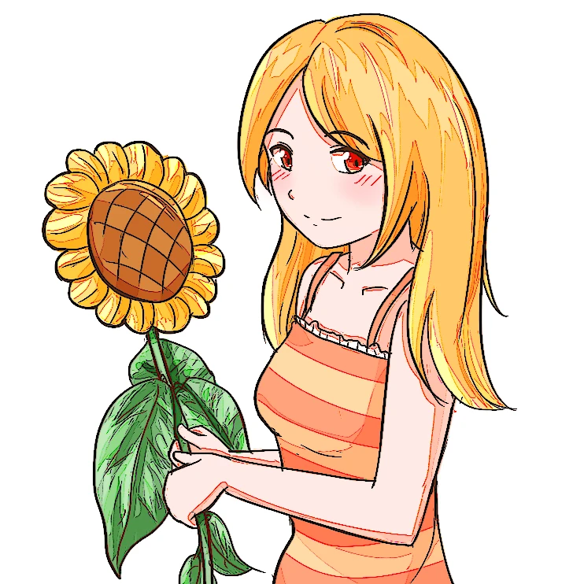</td></tr>
<tr><td>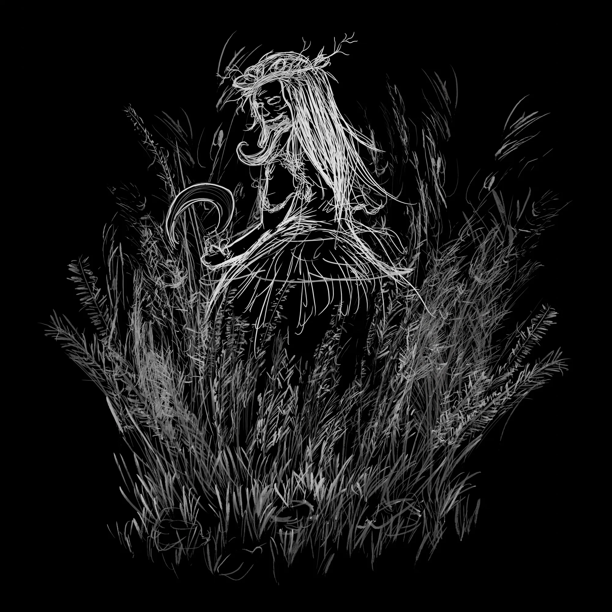</td>
<td></td></tr>

</table>

## Stack

[Vite](https://vitejs.dev/) + [React 19](https://react.dev/) + TypeScript (strict) + raw WebGL2
(no rendering library — twgl/regl, etc.) + [pica](https://github.com/nodeca/pica) for the final
Lanczos3 export downscale.

## Getting started

```sh
npm install
npm run dev      # starts the dev server
npm run build    # type-checks and builds a production bundle to dist/
npm run preview  # serves the production build locally
npm run lint     # oxlint
```

Requires Node.js and npm. No environment variables or backend service needed — it's a static
client-side app.

## Project history

Development sagas, tuning sessions, and per-build changelogs live in [`docs/`](docs) and
[`changelog/`](changelog) — the full trail of what was tried, what got ruled out, and why, across
every algorithm and UI pass.

## License

[GNU AGPLv3](LICENSE). If you host a modified version of this app, the AGPL requires you to make
your modified source available to your users.
